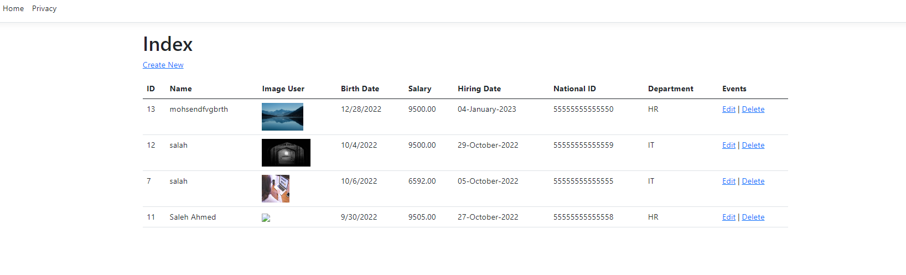
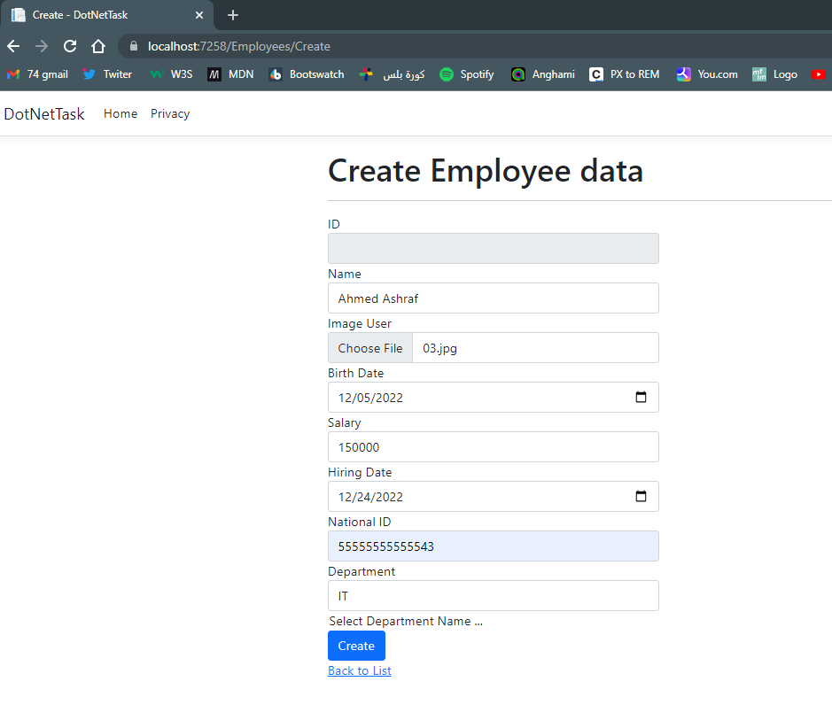
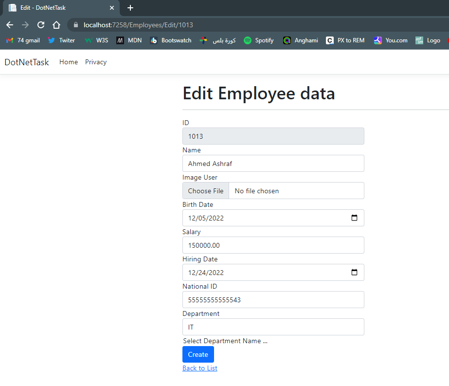
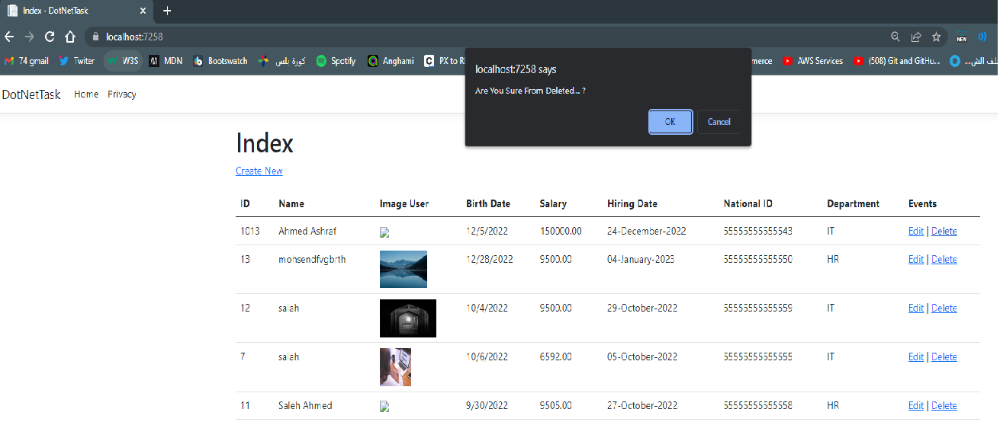

# Employees Mangment System

## CRUD operations using Asp.Net Model-Viewr-Controller With Sql Server DataBase (Code First Approach)

</img>

# Features

### Create New Emplyee Record

#### (Name , Auto Generated Id , BirthDay , Department , Salary , Start Date )

</img>

### Update (Edit) Emplyee Record

#### (Name , Auto Generated Id , BirthDay , Department , Salary , Start Date )

</img>

### Delete Emplyee Record

</img>
## The DataBase Containes Two Tables 
### Departments Table -- 1 : Many -- Employees Table
#### Departments --->(HR<IT)
#### Employee --->(ID, Name ,HireDate,BirthDate,National Id ,Department ,Salary, Image User )
## Packges Work With 
### 1.Entityframeworkcore
### 2.EntityframeworkCore.Tools
### 3.EntityframeworkCore.SqlServer
### 4.EntityframeworkCore.Design
### 5.EntityframeworkCore.CodeGeneration.Design
### 6.EntityframeworkCore.Relational

